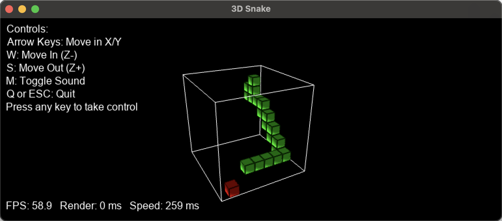

# 3D Snake

3D Snake is a modern twist on the classic snake game, rendered in 3D using Python and OpenGL, and allowing movement in three dimensions.

> This project was created to test and showcase the capabilities of ChatGPT o3-mini-high.

## Features

- **3D Gameplay:**  
  Enjoy a fully 3D playfield where the snake and food are rendered as shaded cubes.

- **Demo Mode:**  
  When the game starts (or after a game over), it enters a demo mode. The snake is AI controlled, and the camera rotates around the playfield. Once you press any movement key, you take over manual control of the snake.

- **Sound Support:**  
  The game plays sound effects for events such as eating food, snake movement, and game over. If WAV files (`eat.wav`, `move.wav`, and `gameover.wav`) are provided in the working directory, they will be loaded; otherwise, default synthesized sounds are used.

- **Adaptive Display:**  
  The game supports resizing the window, as well as full-screen mode.

## Controls

- **Arrow Keys:** Move the snake in the X/Y directions.
- **W:** Move In (Z- direction).
- **S:** Move Out (Z+ direction).
- **M:** Toggle sound on/off.
- **Q or ESC:** Quit the game.

## Installation

### Requirements

- Python 3.x
- PyGame
- PyOpenGL (and PyOpenGL_accelerate)
- NumPy

### Installing Dependencies

You can install the required Python packages with pip:

```bash
pip install pygame PyOpenGL PyOpenGL_accelerate numpy
```

## How to Play

1. **Start the Game:**  
   Run the game by executing:
   ```bash
   python3 snake3d.py
   ```
   Initially, the game will run in demo mode with the AI controlling the snake and the camera rotating around the playfield.

2. **Take Control:**  
   Press any movement key (Arrow keys, W, or S) to take control of the snake.

3. **Gameplay:**  
   Guide the snake to eat the food while avoiding the edges of the playfield, as well as your own tail. The snake speeds up with each food item consumed.

4. **Game Over:**  
   If the snake collides with a wall or itself, a "GAME OVER" screen appears.  
   - Press any key (other than Q or ESC) during the game over screen to restart immediately.
   - If no key is pressed within 3 seconds, the game automatically resets into demo mode.
   - Press Q or ESC at any time to quit the game.

## Technologies Used

This project is built with broad, industry-standard technologies:
- **Python:** The primary programming language.
- **PyGame:** For handling input, sound, and window management.
- **OpenGL:** For 3D rendering and shading.

## Sound Files

If you provide your own WAV files named `eat.wav`, `move.wav`, and `gameover.wav` in the working directory, the game will load and use these for sound effects. If not, default synthesized sounds will be used.

## Credits

This game was developed as a test of ChatGPT o3-mini-high capabilities. Approximately 15 prompts where required to implement the current state, mostly to adjust the shading. Enjoy playing 3D Snake!

## License

I didn't write a single line of code for this project. It thus should be considered as public domain. Feel free to use it as you wish.